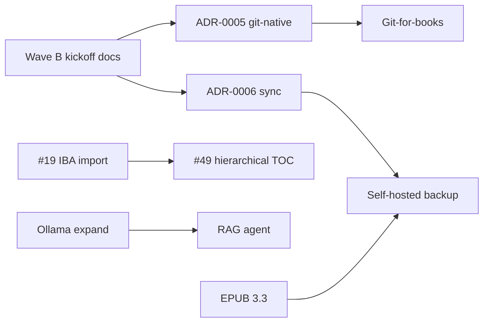

# Wave B Status

**Branch:** `main` · **As of:** July 2026  
**Sources:** [COMPETITIVE_AUDIT.md](COMPETITIVE_AUDIT.md) §5 Wave B, [FUTURE_FEATURES.md](FUTURE_FEATURES.md), [ADR index](adr/README.md)

**Goal:** Ship FOSS differentiation features paid tools can't or won't — IBA import depth, hierarchical TOC, git-native workflow, local AI (RAG + Ollama), EPUB 3.3 metadata, and optional self-hosted backup.

**Status:** 🟡 **In progress** — ADRs drafted for architecture-gated items; implementation tracks not started.

| Phase | Scope | Status |
|-------|-------|--------|
| **Wave B kickoff** | Tracking doc + ADR-0005 (git-native) + ADR-0006 (self-hosted sync) | ✅ July 2026 |
| **Wave B build** | Seven competitive-audit items below | ⬜ Not started |

Track architecture decisions in [docs/adr/](adr/README.md). Items marked **ADR** must have an **Accepted** ADR before feature code merges.

---

## Wave B checklist (7 items)

| # | Item | ADR | Issue | Status | Notes |
|---|------|-----|-------|--------|-------|
| 1 | **Deepen IBA import** — hierarchy report, `sl:tag` semantics, import diagnostics UI | — | [#19](https://github.com/freqkflag/openbook-author/issues/19) | ⬜ Open | Extends `src/lib/iba-import.ts`; no storage contract change |
| 2 | **Hierarchical TOC / parts** — nested spine + nav | — | [#49](https://github.com/freqkflag/openbook-author/issues/49) | ⬜ Open | Book model + EPUB nav changes; coordinate with #19 hierarchy work |
| 3 | **Git-for-books workflow** — open folder, diff-friendly saves, Electron Git panel | [ADR-0005](adr/ADR-0005-git-native-project-mode.md) | _File before build_ — [audit §9 #16](COMPETITIVE_AUDIT.md#9-suggested-github-issue-titles) | 🟡 ADR proposed | Dual storage model vs `.openbook` zip; Electron-first |
| 4 | **AI RAG + consistency agent** — local chapter embeddings; character/timeline/fact check | — | _File before build_ — [audit §9 #10](COMPETITIVE_AUDIT.md#9-suggested-github-issue-titles) | ⬜ Open | Electron pilot; chapter-scoped embeddings; Ollama-friendly |
| 5 | **Expand Ollama** — structured JSON actions, model presets, offline badge | — | _File before build_ — [audit §3](COMPETITIVE_AUDIT.md#3-bleeding-edge-tech--fit-assessment) | ⬜ Open | Low risk; extends `src/app/api/ai/route.ts` + AI panel |
| 6 | **EPUB 3.3 metadata upgrade** — package version + `schema.org` accessibility properties | — | _File before build_ — [audit §9 #18](COMPETITIVE_AUDIT.md#9-suggested-github-issue-titles) | ⬜ Open | Extends ADR-0003 pipeline; backward-compatible |
| 7 | **Self-hosted sync (optional)** — WebDAV or S3-compatible backup of `.openbook` | [ADR-0006](adr/ADR-0006-self-hosted-sync.md) | _File before build_ — [audit §5 item 7](COMPETITIVE_AUDIT.md#wave-b--foss-differentiation-moat-months-2-4) | 🟡 ADR proposed | Opt-in; not realtime collab (Wave C) |

---

## ADR gate (must accept before build)

| Initiative | ADR | Status |
|------------|-----|--------|
| Git-native project folder mode | [ADR-0005](adr/ADR-0005-git-native-project-mode.md) | Proposed |
| Self-hosted backup / sync | [ADR-0006](adr/ADR-0006-self-hosted-sync.md) | Proposed |

Review and move ADRs to **Accepted** before merging feature PRs for items 3 and 7.

---

## Dependencies and sequencing

**Suggested build order:**

1. **Parallel, low coupling:** #19 IBA import, #49 hierarchical TOC (coordinate book model), Ollama expand, EPUB 3.3 metadata.
2. **After ADR-0005 accepted:** git-for-books (folder mode + diff-friendly saves + Electron Git panel).
3. **After Ollama expand:** RAG consistency agent (Electron embeddings store).
4. **After ADR-0006 accepted:** optional WebDAV/S3 backup (depends on stable `.openbook` path model from git or zip save).

---

## Exit criteria

Wave B is **done** when all seven checklist rows are ✅ and:

- ADR-0005 and ADR-0006 are **Accepted** (or superseded by amended ADRs).
- GitHub issues exist and are linked for items 3–7 (currently audit placeholders only).
- [COMPETITIVE_AUDIT.md](COMPETITIVE_AUDIT.md) §5 Wave B status reads **shipped**.
- Relevant modules have Vitest coverage (import report, TOC nav export, git save round-trip, RAG fixture, EPUB 3.3 OPF snapshot).

---

## Related issues — keep open (Wave B scope)

| Issue | Title | Wave B track |
|-------|-------|--------------|
| [#19](https://github.com/freqkflag/openbook-author/issues/19) | Improved IBA import | Item 1 |
| [#49](https://github.com/freqkflag/openbook-author/issues/49) | Hierarchical TOC structure mode | Item 2 |

Wave C items ([#15](https://github.com/freqkflag/openbook-author/issues/15)–[#20](https://github.com/freqkflag/openbook-author/issues/20), realtime collab [#22](https://github.com/freqkflag/openbook-author/issues/22)) remain out of Wave B scope.

---

## Next steps

1. **Review ADR-0005 and ADR-0006** — accept or amend before git/sync implementation.
2. **File GitHub issues** for items 3–7 using [COMPETITIVE_AUDIT.md §9](COMPETITIVE_AUDIT.md#9-suggested-github-issue-titles) titles; update the checklist Issue column.
3. **Start implementation tracks** — recommend #19 and EPUB 3.3 first (smallest architecture surface).
