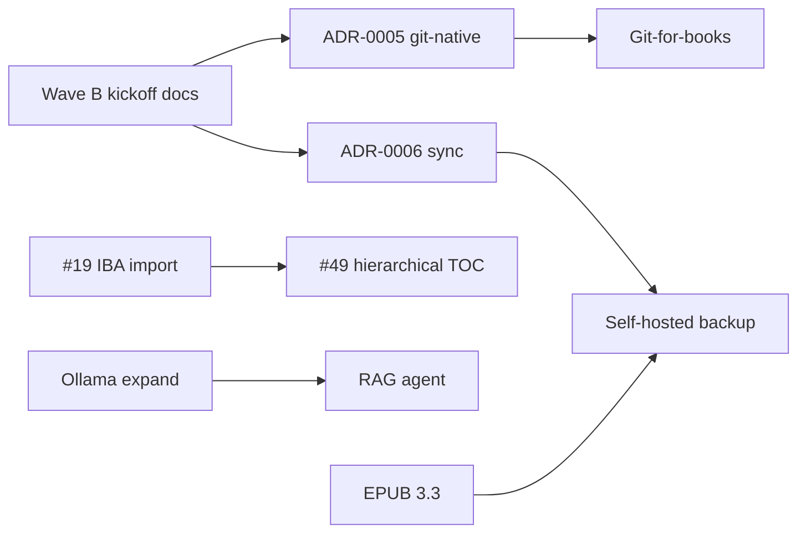

# Wave B Status

**Branch:** `main` · **As of:** July 2026  
**Sources:** [COMPETITIVE_AUDIT.md](COMPETITIVE_AUDIT.md) §5 Wave B, [FUTURE_FEATURES.md](FUTURE_FEATURES.md), [ADR index](adr/README.md)

**Goal:** Ship FOSS differentiation features paid tools can't or won't — IBA import depth, hierarchical TOC, git-native workflow, local AI (RAG + Ollama), EPUB 3.3 metadata, and optional self-hosted backup.

**Status:** 🟡 **In progress** — 5/7 shipped (items 1–2, 4–6); items 3, 7 blocked on ADR-0005 / ADR-0006 acceptance.

| Phase | Scope | Status |
|-------|-------|--------|
| **Wave B kickoff** | Tracking doc + ADR-0005 (git-native) + ADR-0006 (self-hosted sync) | ✅ July 2026 |
| **Wave B.1** | IBA import depth ([#19](https://github.com/freqkflag/openbook-author/issues/19)) | ✅ Shipped July 2026 |
| **Wave B build** | Remaining five competitive-audit items below | 🟡 In progress |

Track architecture decisions in [docs/adr/](adr/README.md). Items marked **ADR** must have an **Accepted** ADR before feature code merges.

---

## Wave B checklist (7 items)

| # | Item | ADR | Issue | Status | Notes |
|---|------|-----|-------|--------|-------|
| 1 | **Deepen IBA import** — hierarchy report, `sl:tag` semantics, import diagnostics UI | — | [#19](https://github.com/freqkflag/openbook-author/issues/19) | ✅ Shipped | `77eeca3` — `IBAImportDiagnostics`, nested hierarchy flattening, `ImportDiagnosticsModal` |
| 2 | **Hierarchical TOC / parts** — nested spine + nav | — | [#49](https://github.com/freqkflag/openbook-author/issues/49) | ✅ Shipped | `d7a633c` — `BookPart` model, nested EPUB nav, KBP `toc.json`, editor parts UI |
| 3 | **Git-for-books workflow** — open folder, diff-friendly saves, Electron Git panel | [ADR-0005](adr/ADR-0005-git-native-project-mode.md) | [#59](https://github.com/freqkflag/openbook-author/issues/59) | 🔒 Blocked | ADR-0005 must be **Accepted** before feature code; dual storage model vs `.openbook` zip; Electron-first |
| 4 | **AI RAG + consistency agent** — local chapter embeddings; character/timeline/fact check | — | [#60](https://github.com/freqkflag/openbook-author/issues/60) | ✅ Shipped | `8bdadf4` — chapter-scoped RAG, consistency check action, Ollama-friendly Electron path |
| 5 | **Expand Ollama** — structured JSON actions, model presets, offline badge | — | [#61](https://github.com/freqkflag/openbook-author/issues/61) | ✅ Shipped | `94f6b29` — model presets, offline badge, structured JSON actions in AI panel |
| 6 | **EPUB 3.3 metadata upgrade** — package version + `schema.org` accessibility properties | — | [#62](https://github.com/freqkflag/openbook-author/issues/62) | ✅ Shipped | `7f80ea0` — EPUB 3.3 OPF, schema.org a11y properties; backward-compatible |
| 7 | **Self-hosted sync (optional)** — WebDAV or S3-compatible backup of `.openbook` | [ADR-0006](adr/ADR-0006-self-hosted-sync.md) | [#63](https://github.com/freqkflag/openbook-author/issues/63) | 🔒 Blocked | ADR-0006 must be **Accepted** before feature code; opt-in; not realtime collab (Wave C) |

---

## Wave B.1 — IBA import depth (July 2026)

| Deliverable | Evidence |
|-------------|----------|
| Nested hierarchy preservation | `flattenHierarchy()` depth-first ordering; parent › child title prefixes; `sectionType` from `node-type` |
| Extended `sl:tag` mapping | h1–h3, blockquote/callout, figcaption, list items, pre/code in `paragraphsToHtml()` |
| Structured diagnostics | `IBAImportDiagnostics` — imported/skipped/lost counts + hierarchy tree |
| Post-import modal | `ImportDiagnosticsModal` on dashboard after IBA import |
| Tests | `iba-import.test.ts` — nested hierarchy, tag semantics, widget diagnostics |

**Not imported (by design):** layout positioning, review/quiz widgets, 3D, Keynote, video/audio widgets, interactive image hotspots.

---

## Wave B.2 — Hierarchical TOC / parts (July 2026)

| Deliverable | Evidence |
|-------------|----------|
| `BookPart` model | `src/types/book.ts` — optional `parts[]` on `Book`; backward compatible with flat `.openbook` files |
| Nested EPUB nav | `buildEpubNavListItems()` in `src/lib/book-structure.ts`; flat spine order preserved |
| KBP nested TOC | `toc.json` + `manifest.toc` in KBP export |
| Editor parts UI | `ChapterSidebar` — add/rename/delete parts, assign chapters |
| Publish readiness | Empty-part errors in `assessPublishReadiness()` |
| Tests | `epub-hierarchical-toc.test.ts`, `book-structure.test.ts` |

---

## ADR gate (must accept before build)

| Initiative | ADR | Status |
|------------|-----|--------|
| Git-native project folder mode | [ADR-0005](adr/ADR-0005-git-native-project-mode.md) | Proposed |
| Self-hosted backup / sync | [ADR-0006](adr/ADR-0006-self-hosted-sync.md) | Proposed |

Review and move ADRs to **Accepted** before merging feature PRs for items 3 and 7.

---

## Dependencies and sequencing

**Suggested build order:**

1. **Parallel, low coupling:** ~~#19 IBA import~~ ✅, ~~#49 hierarchical TOC~~ ✅, ~~#61 Ollama expand~~ ✅, ~~#60 RAG agent~~ ✅, ~~#62 EPUB 3.3 metadata~~ ✅.
2. **After ADR-0005 accepted:** git-for-books ([#59](https://github.com/freqkflag/openbook-author/issues/59)) — folder mode + diff-friendly saves + Electron Git panel. **Blocked** until ADR-0005 is Accepted.
3. **After ADR-0006 accepted:** optional WebDAV/S3 backup ([#63](https://github.com/freqkflag/openbook-author/issues/63)) — depends on stable `.openbook` path model from git or zip save. **Blocked** until ADR-0006 is Accepted.

---

## Exit criteria

Wave B is **done** when all seven checklist rows are ✅ and:

- ADR-0005 and ADR-0006 are **Accepted** (or superseded by amended ADRs).
- GitHub issues are linked for items 3–7 ([#59](https://github.com/freqkflag/openbook-author/issues/59)–[#63](https://github.com/freqkflag/openbook-author/issues/63)).
- [COMPETITIVE_AUDIT.md](COMPETITIVE_AUDIT.md) §5 Wave B status reads **shipped**.
- Relevant modules have Vitest coverage (import report, TOC nav export, git save round-trip, RAG fixture, EPUB 3.3 OPF snapshot).

---

## Related issues — shipped (closed)

| Issue | Title | Note |
|-------|-------|------|
| [#19](https://github.com/freqkflag/openbook-author/issues/19) | Improved IBA import | Wave B item 1 — `77eeca3` |
| [#49](https://github.com/freqkflag/openbook-author/issues/49) | Hierarchical TOC structure mode | Wave B item 2 — `d7a633c` |
| [#60](https://github.com/freqkflag/openbook-author/issues/60) | AI RAG consistency pass | Wave B item 4 — `8bdadf4` |
| [#61](https://github.com/freqkflag/openbook-author/issues/61) | Expand Ollama | Wave B item 5 — `94f6b29` |
| [#62](https://github.com/freqkflag/openbook-author/issues/62) | EPUB 3.3 metadata upgrade | Wave B item 6 — `7f80ea0` |

## Related issues — open (ADR-gated)

| Issue | Title | Wave B track | Blocker |
|-------|-------|--------------|---------|
| [#59](https://github.com/freqkflag/openbook-author/issues/59) | Git-friendly project folder mode | Item 3 | [ADR-0005](adr/ADR-0005-git-native-project-mode.md) — Proposed |
| [#63](https://github.com/freqkflag/openbook-author/issues/63) | Self-hosted sync | Item 7 | [ADR-0006](adr/ADR-0006-self-hosted-sync.md) — Proposed |

Wave C items ([#15](https://github.com/freqkflag/openbook-author/issues/15)–[#20](https://github.com/freqkflag/openbook-author/issues/20), realtime collab [#22](https://github.com/freqkflag/openbook-author/issues/22)) remain out of Wave B scope.

---

## Next steps

1. **Accept ADR-0005 and ADR-0006** — required before items 3 (git-for-books) and 7 (self-hosted sync) can ship.
2. **Implement ADR-gated items** — [#59](https://github.com/freqkflag/openbook-author/issues/59) git-for-books, [#63](https://github.com/freqkflag/openbook-author/issues/63) self-hosted sync.
