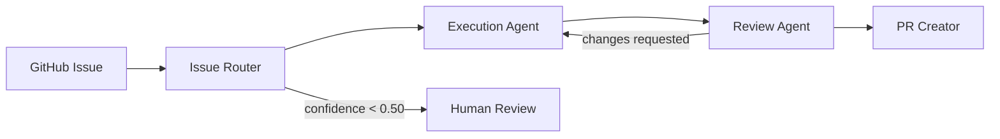

# OpenBook Studio Agent Router

The **Studio Orchestrator** is a CLI library that implements the agent handoff workflow defined in [ADR-0004](./adr/ADR-0004-agent-handoff-contract.md). It mirrors the Cursor `@issue-router` rules and produces YAML handoffs that execution agents consume.

## Workflow



Today the orchestrator routes directly to execution agents. The Knowledge Agent slot (Phase 2) is reserved for future use; `relevant_adrs` provides interim architectural context per [@architecture-memory](../.cursor/rules/architecture-memory.mdc).

## Handoff contract

All handoffs follow the YAML schema in [@handoff-contract](../.cursor/rules/handoff-contract.mdc):

| Handoff | Producer | Consumer |
|---------|----------|----------|
| Router | Issue Router | Execution agents |
| Execution | Execution agents | Review Agent |
| Review | Review Agent | PR Creator or back to execution |

## CLI usage

Install dependencies (`npm install`), then:

### Route an issue

```bash
npm run studio -- route \
  --title "Fix export crash on large guidebooks" \
  --body "Steps to reproduce: ..." \
  --issue 6
```

Prints Router Handoff YAML plus `NEXT:` and `WORKFLOW:` lines.

If [GitHub CLI](https://cli.github.com/) is installed and authenticated, fetch issue metadata automatically:

```bash
npm run studio -- route --issue 6
```

You can still override title/body with explicit flags.

### Get next agent from a handoff file

```bash
npm run studio -- next --file handoff.yaml
```

Reads a YAML handoff (fenced or raw) and prints the next agent instruction.

### Validate a handoff

```bash
npm run studio -- validate --file handoff.yaml
```

Exits `0` when valid, `1` with field errors when invalid.

## GitHub automation flow

1. Author opens an issue via a structured template (`feature.yml`, `bug.yml`, etc.).
2. [`issue-labeler.yml`](../.github/workflows/issue-labeler.yml) applies keyword labels and the `router-ready` signal.
3. [`issue-router.yml`](../.github/workflows/issue-router.yml) posts one deduped `@issue-router` comment with copy-paste instructions for Cursor.
4. In Cursor, attach `@issue-router` (or run `npm run studio route`) to produce the Router Handoff.
5. Attach the routed execution agent (`@debug-agent`, `@feature-agent`, etc.) with the handoff YAML.
6. Execution agent completes work and emits an Execution Handoff → `@review-agent`.
7. Review agent emits Review Handoff → `@pr-creator-agent` when approved.

When Cursor automations cannot write issue comments or labels directly, handoff-only PRs bridge the gap:

- Dispatch handoffs: `.openbook/dispatch/issue-<n>.yaml`
- Execution handoffs: `.openbook/execution/issue-<n>.yaml`
- Review handoffs: `.openbook/review/issue-<n>.yaml`

The corresponding GitHub workflows post the YAML back to the linked issue and apply the routing labels. Review handoffs add `approved-for-merge` for `verdict: approved`; `changes_requested` and `blocked` add `needs-rework` and route back to the handoff `next_agent`.

## Agent rules

Cursor agent definitions live in [`.cursor/rules/`](../.cursor/rules/):

| Agent | Rule file |
|-------|-----------|
| Issue Router | [issue-router.mdc](../.cursor/rules/issue-router.mdc) |
| Debug | [debug-agent.mdc](../.cursor/rules/debug-agent.mdc) |
| Feature | [feature-agent.mdc](../.cursor/rules/feature-agent.mdc) |
| Review | [review-agent.mdc](../.cursor/rules/review-agent.mdc) |
| PR Creator | [pr-creator-agent.mdc](../.cursor/rules/pr-creator-agent.mdc) |

Shared contracts: [handoff-contract.mdc](../.cursor/rules/handoff-contract.mdc), [architecture-memory.mdc](../.cursor/rules/architecture-memory.mdc).

## Library modules

| Module | Purpose |
|--------|---------|
| `src/studio/orchestrator/types.ts` | Handoff TypeScript types |
| `src/studio/orchestrator/parse-handoff.ts` | Parse and validate YAML handoffs |
| `src/studio/orchestrator/route-issue.ts` | Rule-based issue classification |
| `src/studio/orchestrator/workflow.ts` | State machine for next-agent routing |
| `src/studio/orchestrator/prompts.ts` | `NEXT:` / `WORKFLOW:` line generation |

## Confidence gates

| Confidence | Behavior |
|------------|----------|
| ≥ 0.75 | Route normally, `escalate: false` |
| 0.50 – 0.74 | Route with caution in `recommendation` |
| < 0.50 | `escalate: true`, `agent: null` — human triage required |

## Related

- [ADR-0004: Agent handoff contract](./adr/ADR-0004-agent-handoff-contract.md)
- [ADR index](./adr/README.md)
